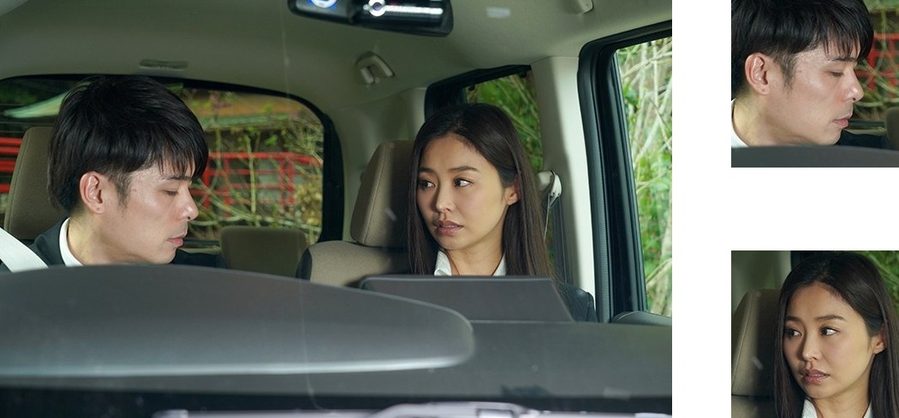
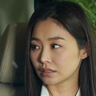

## Script Descriptions

Scripts in this folder can be used to help clean noise in images.

There are three scripts in this part. The script `face_crop_and_size_filter.py` is used to crop face with margin from image and discard those small faces detected. The script `man_face_and_no_face_filter.py` is using CNN classificatyion model to filter images with no face and faces which belong to male actors. The script `face_align.py` is used to align faces and crop faces with special width/height ratio.

You should run these scripts in order, otherwise there would be some unexpected results.

___

### face_crop_and_size_filter

#### Background

Raw images we have downloaded are usually large and contain unuseful parts. So in this script, we crop faces from images with margin. For example, if the face size in face detection result is (100,100), we would crop and save an image with a size of about (200, 200). The margin around the face helps us avoid losing information duiring face alignment process.

In addition, we would discard those small faces which are smaller than the threshold size. In many papers, it has been found out that small faces (low resolution) will lead to low accuracy. So we would like to discard those images in order to achieve high accuracy. If you don't collect enough images, you can set a small threshold ro keep more small images.

#### Usage Description

You can run this script using command like `python face_crop_and_size_filter.py --input_dir dir --output_dir dir --model str --threshold int --threads int`. The option descriptions are shown below.

- input_dir: input image directory

- output_dir: output image directory to save images after processed

- model: choose model to detect face. There are two options here, dlib and dlib_cnn. Dlib uses fromtal face detector in dlib, and its speed is fast with a nice accuracy. Dlib_cnn uses cnn face detector in dlib, and its speed is very slow, but its accuracy is also very high. So you can choose anyone according to your computer.

- threshold: face filter threshold. Face size smaller than threshold will be discarded.

- threads: thread number to run the script. As dlib_cnn runs at a very slow speed, a multi thread/process function is necessary to save time. You can set threads equal to the kernel number of your cpu to speed up.

As you can, the two faces in the example image was detected and cropped out.

#### Notice

Before using, you should install dlib and download `mmod_human_face_detector.dat` from [dlib website](http://dlib.net/files/mmod_human_face_detector.dat.bz2). Then you should put the model data file in ../data directory, otherwise there would be a `file not found` error.

___

### male_face_and_no_face_filter

#### Background

Though what we really want are images of those beautiful actresses, we still downloaded some male actors' images. And this is quite normal because adult videos usually has both actresses and actors. These male actors' faces are noise in our dataset. In addition, the face detection model in dlib is not always right especially when you choose to use dlib frontal face detector. To remove all these male-face images and images without faces, I choose to train a CNN classification model.

#### Usage Description

You can run this script with command `python male_face_and_no_face_filter.py --model resnet18_v2 --class_number 4 --use_gpu True --input_dir ../data/xxx --threshold 0.9`.  The option descriptions are shown below.

- model: CNN model name. In this script, a resnet18_v2 CNN model is used. You can find more models in model zoo provided by MXNet.

- class_number: CNN model class number. With this model you can predict probabilties of four classes. Class 1 is good face image; class 2 is bad face image; class 3 is male actor image; class 4 is no face image. The training log shows a pretty high accuracy for latter two classes. And to separate good faces from bad faces, I'm still looking for a good and simple method. Maybe using facial landmark detector to locate facial landmarks and calculate facial degree is one way. But it isn't good. In some images, the facial degree is normal, but there is mosaic around face. So using CNN model is better.

- use_gpu: while to use gpu or not. Using gpu device to compute is faster. If you have gpu, just use it.

- input_dir: input images directory.

- threshold: probability threshold. If the third class (male face image) or the forth class (no face image) probability higher than the threshold, the script will delete corresponding image.

The result of faces in example image are shown belown. In the sheet, we can see that the probability of class 3 is 0.928 for man's face. But the probability class 3 for woman's face is higher than 0.5. So when choosing a probability threshold, you should be careful.

| image name/prabability | class 1 | class 2 | class 3 | class 4 |
| :------: | :------: | :------: | :------: | :------: |
|  | 0.012 | 0.056 | 0.928 | 0.003 |
|  | 0.458 | 0.018 | 0.524 | 0.000 |

#### Notice

Before usage, you should download or train a classfication model. I have uploaded a model in google drive disk, you can download it in [this link](https://drive.google.com/open?id=1y8Nz45jZt9K8QxaSE_XM66o-JkAGwYuk). After downloading the model, you should put the model params file into ../data directory. If you want to train your own CNN model, you should prepare your own dataset. And in another way, you should classify the images manually. As a boring job, It may take you a lot time.

In this script, male-face images and images without faces are deleted after predication. Of course you can change the script's behavior after computing the probability. For example, you could move the image to another directory if you don't want to delete them directly. Or you can write the result into a txt file, and process these images later.

___

### face_align

#### Background

After clearning with the above two scripts, we already have a good dataset. But to reach state-of-the-art accuracy, we need to align the face to the same position and normalize the image size with a width/height ratio of 7:8. Considering that our dataset is mainly composed of asian women, this could be a hard task.

#### Usage Description

#### Notice

