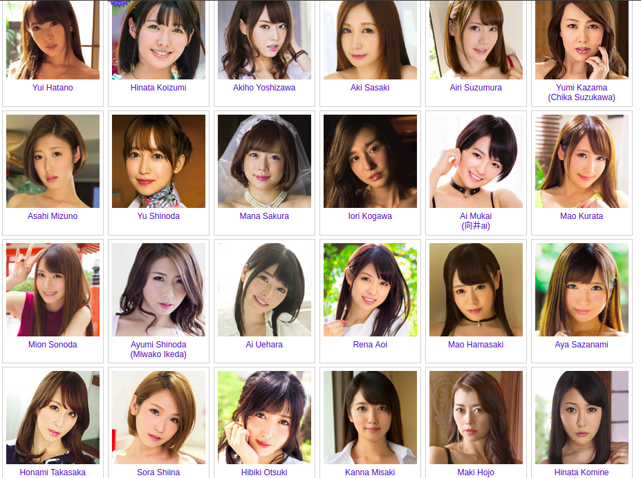

## Background

As a male born in China in 90s, watching Japanese adult video is normal. Even though there are many ridiculous mistakes in those videos, we have learned a lot. I appreciate for this. However, apart from some very famous actresses, such as Aoi Sora, Akiho Yoshizawa, Maria Ozawa and Yui Hatano, who else do we know? When a beautiful actress shown in a video or gif, can we find out who she is? As Japanese adult video industry produces tens of thousands of videos every year with plenty of new actresses, it is difficult for us to remember all of them.

Some JAV actresses are shown in the picture below. How many can you recognize?

At the same time, using deep learning method face recognition has achieved the same performance as human being. It has been used to solve many real-world problems. So why can’t we use it to do something funny and helpful?

This is the reason why I try to write such a project.

## Pipeline

To start from scratch, we need to collect enough actress images, clean the images, and choose a perfect model to train. 

-	collect data: As the copyright of most images are held by related companies, so I can’t share them with you. But there is a scrapper script listed in this project. You can use it to download images from [JAV database](https://xxx.xcity.jp). Similarly, you can write your own script to collect images from other websites.

-	clean data: Except some rotogravure images, the actress images we collected are dirty and have much noise. To some grand face datasets, noise can be ignored. As we have a pretty small dataset, we should clean it before usage. Another import thing in this part is face alignment. It will help us to achieve a better result.

-	train CNN model: After all those things above done, we can choose a CNN model to train. I can’t figure out what structure a perfect model would have. But I know you should choose your model structure according to the size of face recognition dataset. With a big dataset, you can choose a big and complicated structure; with a small dataset, you can choose a small structure to avoid over fitting. Before training, you should also have to choose a loss function. Here, I will use center loss, as it’s simple and good.

-	predict: With the CNN model and all the features of actresses, you can predict who the actress is in some picture. Hereby, I use KNN to do face recognition. There are some other machine learning methods. You can try if you like.

## Problems

Though the pipeline seems simple, there would be many problems to solve. And it is hard to achieve an excellent accuracy as the problems are difficult to handle. 

In the first step, the website of JAV database is forbidden in China. So either you use a foreign server to download the images, or you use network agent to go cross the great fire wall. 

In the second step, there are many wrong images in the dataset. In some images, there are more than one actress; and in other images, the actor in the picture is male. And when you try to align the face, some rotated faces are difficult to deal with.

In the third step, you should do many experiments to choose the best model and loss function. As deep learning looks like a black box sometimes, you might spend quite a lot time on it. 

## Dependence

To use this script, you have to install many packages. They are listed below.
- opencv-python
- dlib
- mxnet
- argparse
- bs4
